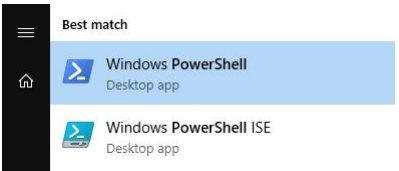

---
<<<<<<< HEAD

=======
typora-copy-images-to: ../assets/img/powershell/
typora-root-url: ../
layout: post
title:  Powershell
categories: parte1
conToc: true
permalink: powershell
>>>>>>> origin

---

## Apuntes PowerShell 

Índice 

1. Introducción 
2. Comandos básicos 
3. Comentarios, variables y tipos de datos en PowerShell 
4. Operaciones básicas en PowerShell 
5. Estructuras condicionales 
6. Estructuras repetitivas 
7. Comandos de fecha y hora 
8. Comandos de archivos y carpetas 
9. Importación de datos 
10. Funciones

## 1. Introducción

**PowerShell** es un intérprete de línea de comandos orientado a objetos. Fue diseñado para su uso por parte de administradores, con el propósito de automatizar tareas o realizarlas de forma más controlada.

[Manual de PowerShell 5.1 de Microsoft](https://docs.microsoft.com/es-es/powershell/scripting/overview?view=powershell-5.1)

Tenemos dos opciones a la hora de ejecutar PowerShell:
1) Entorno gráfico: PowerShell ISE (del inglés, Integrated Scripting Environment).
2) Entorno comando: Windows Powershell

