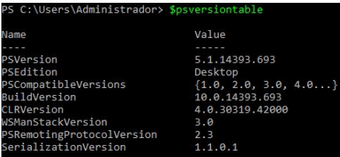
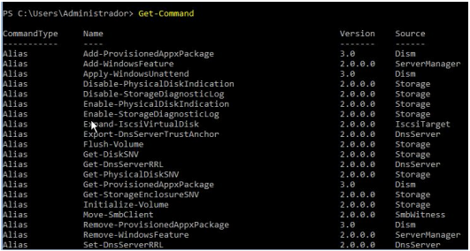
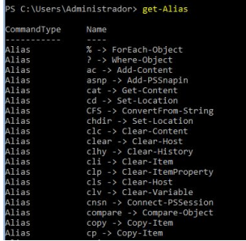

## Apuntes Powershell

## 1. Introducción

**PowerShell** es un intérprete de línea de comandos orientado a objetos. Fue diseñado para su uso por parte de administradores, con el propósito de automatizar tareas o realizarlas de forma más controlada.

[Manual de PowerShell 5.1 de Microsoft](https://docs.microsoft.com/es-es/powershell/scripting/overview?view=powershell-5.1)

Tenemos dos opciones a la hora de ejecutar PowerShell:
1) Entorno gráfico: PowerShell ISE (del inglés, Integrated Scripting Environment).
2) Entorno comando: Windows Powershell

## 2. Comandos básicos

- **$psversiontable** : Muestra la versión de PowerShell instalada.

-  **Get-Command** : Muestra todos los comandos disponibles

- **Clear-Host** : Limpia la pantalla

  

### 2.1 Comandos básicos. Alias

Un **alias** es un nombre alternativo o sobrenombre para un cmdlet o un elemento de un comando, como una funcion, un script, un archivo o un archivo ejecutable. El tema es que podemos utilizar el alias en lugar de el nombre completo del cmdlet. Podemos utilizar en **Windows Powershell** comandos como “dir” o “ls” y muchos más. Estos no son mas que alias definidos a otros comandos de Powershell

- Get-Alias : Nos devuelve un listado con todos los alias definidos en el sistema

  
