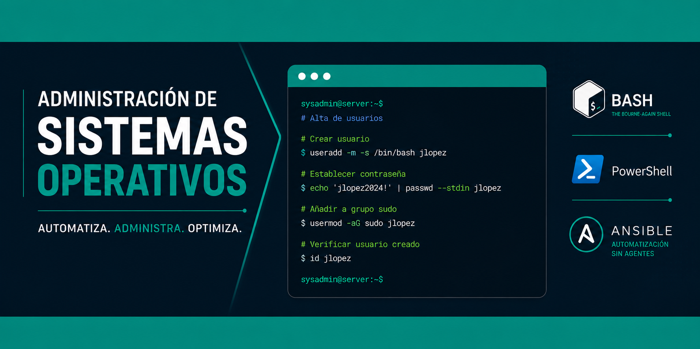

# Administración de Sistemas Operativos

Bienvenido a los apuntes de **Administración de Sistemas Operativos (ASO)**.

Aquí encontrarás todos los contenidos del módulo:

- [UT0. Introducción a Git y Github](git/introduccion.md)
- [UT1. Bash](linux/bash.md)
- [UT2. Procesos, Servicios y Automatización](linux/procesos.md)
- [UT3. Acceso y Administración Remota en Linux](linux/acceso-remoto.md)
- [UT4. Servicio de Directorio en Linux](linux/directorio.md)
- [UT4. Samba](linux/samba.md)
- [UT5. Ansible](linux/ansible.md)
- [UT6. PowerShell](scripts/powershell.md)
- [UT7. Directorio Activo en Windows](wserver/directorio-activo.md)
- [UT7. PowerShell - Directorio Activo](scripts/powershell-directorio.md)
- [UT8. Administración en Windows](wserver/administracion.md)
- [UT9. Kubernetes](linux/kubernetes.md)
