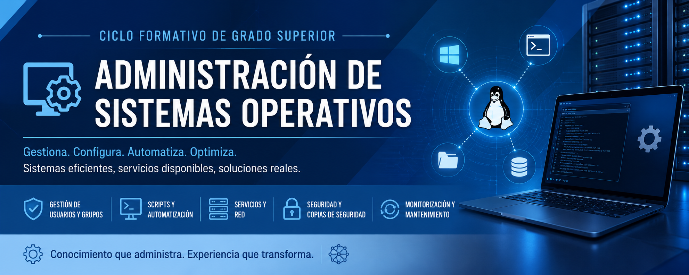

---
hide:
  - navigation
---

# Administración de Sistemas Operativos

Bienvenido a los apuntes de **Administración de Sistemas Operativos (ASO)**.

Aquí encontrarás todos los contenidos del módulo:

- [UT0. Introducción a Git y Github](git/introduccion.md)
- [UT1.1. Bash](linux/bash.md)
- [UT1.2. Bash Avanzado](linux/bash-avanzado.md)
- [UT2. Procesos, Servicios y Automatización](linux/procesos.md)
- [UT3. Acceso y Administración Remota en Linux](linux/acceso-remoto.md)
- [UT4. Ansible](linux/ansible.md)
- [UT5.1. Servicio de Directorio en Linux](linux/directorio.md)
- [UT5.2. Samba](linux/samba.md)
- [UT6. PowerShell](scripts/powershell.md)
- [UT7.1. Directorio Activo en Windows](wserver/directorio-activo.md)
- [UT7.2. PowerShell - Directorio Activo](scripts/powershell-directorio.md)
- [UT8. Administración en Windows](wserver/administracion.md)
- [UT9. Monitorización Centralizada y Alertas](linux/monitorizacion.md)

## Resultados de aprendizaje del módulo

Según el currículo oficial (RD 1629/2009), al finalizar el módulo el alumnado será capaz de:

| RA | Resultado de aprendizaje | Ponderación |
|----|--------------------------|:----------:|
| **RA1** | Administra el servicio de directorio interpretando especificaciones e integrándolo en una red. | 20 % |
| **RA2** | Administra procesos del sistema describiéndolos y aplicando criterios de seguridad y eficiencia. | 15 % |
| **RA3** | Gestiona la automatización de tareas del sistema, aplicando criterios de eficiencia y utilizando comandos y herramientas gráficas. | 15 % |
| **RA4** | Administra de forma remota el sistema operativo en red valorando su importancia y aplicando criterios de seguridad. | 12 % |
| **RA5** | Administra servidores de impresión describiendo sus funciones e integrándolos en una red. | 5 % |
| **RA6** | Integra sistemas operativos libres y propietarios, justificando y garantizando su interoperabilidad. | 8 % |
| **RA7** | Utiliza lenguajes de guiones en sistemas operativos, describiendo su aplicación y administrando servicios del sistema operativo. | 25 % |
| | **Total** | **100 %** |
