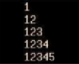
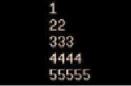

# UT1.1. Bash — Ejercicios

!!! example "Tarea"
    Resuelve los ejercicios que se plantean a continuación. Están agrupados por
    bloques temáticos.

## Básicos

### Ejercicio 1. Hola Mundo

Crea un shell script que muestre por pantalla el mensaje “**¡Hola Mundo!**”.

??? success "Solución"
    ```bash
    #!/bin/bash

    echo "¡Hola Mundo!"
    ```

### Ejercicio 2. Listado del directorio /etc

Realiza un script que guarde en un fichero el listado de archivos y directorios
de la carpeta *etc*, a posteriori que imprima por pantalla dicho listado.

??? success "Solución"
    ```bash
    #!/bin/bash

    ls /etc > listado.txt
    cat listado.txt
    ```

### Ejercicio 3. Listado de /etc con recuento de líneas y palabras

Modifica el script anterior para que además muestre por pantalla el número de
líneas del archivo y el número de palabras.

??? success "Solución"
    ```bash
    #!/bin/bash

    ls /etc > listado.txt
    cat listado.txt

    wc -l listado.txt
    wc -w listado.txt
    ```

### Ejercicio 4. Pedir y mostrar dos números

Diseña un script en Shell que pida al usuario dos números, los guarde en dos
variables y los muestre por pantalla.

??? success "Solución"
    ```bash
    #!/bin/bash

    read -p "Introduce el primer número: " num1
    read -p "Introduce el segundo número: " num2

    echo "El primer número es: $num1"
    echo "El segundo número es: $num2"
    ```

### Ejercicio 5. Media aritmética de dos números

Crea un script donde se pida al usuario dos números y muestre la media
aritmética.

??? success "Solución"
    ```bash
    #!/bin/bash

    read -p "Introduce el primer número: " num1
    read -p "Introduce el segundo número: " num2

    media=$(echo "scale=2; ($num1 + $num2) / 2" | bc)

    echo "La media aritmética es: $media"
    ```

### Ejercicio 6. Añadir palabras a lista.txt

Crea un script donde se pida al usuario una palabra y se vaya añadiendo al mismo
fichero de nombre lista.txt. Cada vez que se ejecute el script, se añadirá la
nueva palabra al archivo lista.txt.

??? success "Solución"
    ```bash
    #!/bin/bash

    read -p "Introduce una palabra: " palabra

    echo "$palabra" >> lista.txt

    echo "Contenido actual de lista.txt:"
    cat lista.txt
    ```

### Ejercicio 7. Comprimir un directorio en tar.gz con fecha

Realiza un script que, dado un directorio pasado por parámetro, cree un archivo
tar comprimido con gzip y con nombre igual a la fecha en formato yyyy-mm-dd
seguido del directorio acabado en .tar.gz

??? success "Solución"
    ```bash
    #!/bin/bash

    directorio=$1

    fecha=$(date +%Y-%m-%d)
    nombre="${fecha}-$(basename "$directorio").tar.gz"

    tar -czf "$nombre" "$directorio"

    echo "Creado el archivo $nombre"
    ```

## Estructuras condicionales

### Ejercicio 8. Mayor de dos números

Crea un script donde se pida al usuario dos números y diga cúal es mayor.

??? success "Solución"
    ```bash
    #!/bin/bash

    read -p "Introduce el primer número: " num1
    read -p "Introduce el segundo número: " num2

    if [ "$num1" -gt "$num2" ]; then
        echo "El mayor es $num1"
    elif [ "$num2" -gt "$num1" ]; then
        echo "El mayor es $num2"
    else
        echo "Los dos números son iguales"
    fi
    ```

### Ejercicio 9. Menú de operaciones matemáticas

Realiza un script que contenga un menú, de forma que muestre las cuatro
operaciones matemáticas básicas: sumar, restar, multiplicar y dividir. Solicita
dos números al usuario y muestra el resultado en función de la opción
seleccionada.

### Ejercicio 10. parimpar.sh: par o impar

Crea un script parimpar.sh que solicite un número y diga si es par o impar.

### Ejercicio 11. Copiar un fichero con validaciones

Realizar un shell script que copie el fichero indicado como primer parámetro
posicional de manera que la copia tenga el nombre indicado en el segundo
parámetro posicional. Hay que controlar:

a) Que se indiquen dos parámetros.
b) Que exista y sea archivo ordinario el primer parámetro.
c) Que no exista un identificador (fichero ordinario, directorio, etc..) con el
mismo nombre que el indicado en el segundo parámetro.

Si se produce alguna de las situaciones anteriores se visualizará un mensaje de
error indicativo.

### Ejercicio 12. Buenos días / tardes / noches según la hora

Crea un shell script que al ejecutarlo muestre por pantalla uno de estos
mensajes **“Buenos días”**, **“Buenas tardes”** o **“Buenas noches”**, en
función de la hora que sea en el sistema (de 8:00 de la mañana a 15:00 será
mañana, de 15:00 a 20:00 será tarde y el resto será noche). Para obtener la hora
del sistema utiliza el comando date.

### Ejercicio 13. AGENDA: mantenimiento de lista.txt

Construye un programa denominado AGENDA que permita mediante un menú, el
mantenimiento de un pequeño archivo lista.txt con el nombre, dirección y
teléfono de varias personas. Debes incluir estas opciones al programa:

- **Añadir** (añadir un registro)
- **Buscar** (buscar entradas por nombre, dirección o teléfono)
- **Listar** (visualizar todo el archivo).
- **Ordenar** (ordenar los registros alfabéticamente).
- **Borrar** (borrar el archivo).

### Ejercicio 14. gestionusuarios.sh: alta y baja de usuarios

Realizar un script **gestionusuarios.sh** que permita dar de alta y de baja a
usuario del sistema GNU/Linux indicados como argumento:

```text
./gestionusuarios.sh alta/baja nombre apellido1 apellido2 [grupo]
```

- En el caso de que se le pase la opción alta: el script asignará al usuario un
  identificativo para el sistema con el formato aluXXYYZ donde XX son las dos
  primeras letras del apellido1, YY son las dos primeras letras del apellido2 y
  Z es la inicial del nombre. En caso de no indicar el grupo al que pertenece,
  se creará un nuevo grupo con el mismo identificativo que el usuario.
- En el caso de que se le pase la opción baja: el programa debe calcular la
  identificación del usuario, igual que se indica en el menú anterior, y
  proceder a dar de baja la cuenta.
- En otro caso. Indicar “Error. La sintaxis correcta es ./gestionusuarios.sh
  alta/baja nombre apellido1 apellido2 [grupo]”

## Bucles

### Ejercicio 15. Tabla de multiplicar de n

Realiza un script que, dado un número n pasado por parámetro, muestre su tabla
de multiplicar con el formato de salida siguiente: i x n = resultado.

### Ejercicio 16. Suma del 1 al 1000 con for, while y until

Crea un shell script que sume los números del 1 al 1000 mediante una estructura
`for`, `while` y `until`.

### Ejercicio 17. Suma acumulada hasta introducir 0

Haz un script que vaya dando la suma de todos los números que se introduzca por
teclado hasta que se introduzca un 0, en cuyo caso se mostrará el último
resultado y terminará el script.

### Ejercicio 18. Patrón con for (I)

Realizar un script utilizando el bucle for que muestre el siguiente patrón:



### Ejercicio 19. Patrón con for (II)

Realizar un script utilizando la estructura el bucle for que muestre el
siguiente patrón:



### Ejercicio 20. primo.sh: comprobar si un número es primo

Crea un script primo.sh que verifique si el número pasado por parámetro es primo
o no.

### Ejercicio 21. juego.sh: adivinar un número

Crea un script juego.sh que consista en un juego de adivinar un número del 1 al
100. El número a adivinar se pondrá fijo al principio del script. Se le irán
preguntando números al usuario y se dirá si el número es mayor o menor que el
que hay que adivinar. El juego termina si el usuario averigua el número (Mensaje
de Enhorabuena) o introduce un 0 (Se rinde).

### Ejercicio 22. Listar entradas de un directorio

Realizar un script que reciba como único parámetro el nombre de un directorio,
especificado mediante su nombre de ruta completo. El programa debe mostrar un
listado no recursivo de todas las entradas contenidas en ese directorio,
indicando para cada una de ellas si se trata de un fichero o de un directorio.
Al final, debe mostrarse un mensaje indicando el número total de entradas
procesadas.

### Ejercicio 23. Tipos de entrada en /dev

Modifica el script anterior para que indique si se trata de un fichero, de un
directorio, de un enlace simbólico, un archivo especial de bloque, archivo
especial de caracter. Debes pasarle el directorio /dev y verificar que funciona
bien.

### Ejercicio 24. Estadísticas de ficheros y subdirectorios

Escribir un script que, dado el nombre de un directorio como parámetro, muestre
las estadísticas de cuantos ficheros y cuantos subdirectorios contiene. Debes
comprobar que existe el directorio que se pasa como parámetro y que
efectivamente es un directorio.
