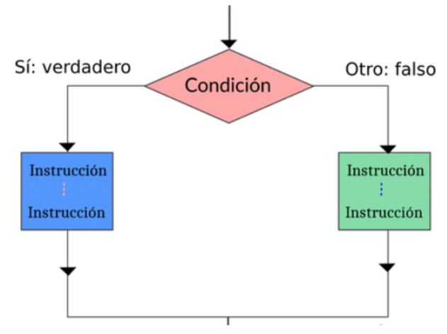
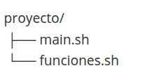
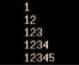
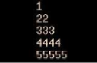

**CFGS Administración de Sistemas Informáticos y Redes**

Material elaborado por Ángela Bañuls Serrano

!!! info "Contenido visto en 1º"
    Esta unidad fue trabajada en el módulo **Implantación de Sistemas Operativos** de 1º. Debes **repasarla de forma autónoma** antes de continuar con los contenidos del curso.

# Manual de Shell Script

**Índice**

1. [Introducción](#id1)
2. [Nuestro primer Script "Hola mundo"](#id2)
3. [Variables](#id3)
4. [Entrada de datos por el usuario](#id4)
5. [Comentarios](#id5)
6. [Parámetros](#id6)
7. [Arrays](#id7)
8. [Matemáticas en bash](#id8)
9. [Evaluación de expresiones](#id9)
    1. [Expresiones de archivos](#id91)
    2. [Expresiones de cadenas](#id92)
    3. [Expresiones numéricas](#id93)
    4. [Expresiones lógicas](#id94)
10. [Condicionales](#id10)
11. [Bucles](#id11)
    1. [Bucles con for](#id111)
    2. [Bucles con while](#id112)
    3. [Bucles con until](#id113)
    4. [Continue y Break](#id114)
12. [Funciones](#id12) 
13. [Depuración y testeo](#id13)


## Programación de Aula

### Resultados de Aprendizaje

Esta unidad cubre el **Resultado de aprendizaje 7 (RA7)** según el **Real Decreto 1629/2009, de 30 de octubre**, el cual es:

1. Utiliza lenguajes de guiones en sistemas operativos, describiendo su aplicación y administrando servicios del sistema operativo.

Los criterios de evaluación asociados son:

​	a. Se han utilizado y combinado las estructuras del lenguaje para crear guiones.

​	b. Se han utilizado herramientas para depurar errores sintácticos y de ejecución.

​	c. Se han implantado guiones en sistemas libres y propietario.

​	d. Se han realizado cambios y adaptaciones de guiones del sistema.

​	e. Se han implantado guiones en sistemas libres y propietarios

​	f. Se han consultado y utilizado librerías de funciones.

​	g. Se han documentado los guiones creados.


### Planificación Temporal (6 sesiones / 12 horas)

| Sesión | Contenido                                                    |
| ------ | ------------------------------------------------------------ |
| 1      | Introducción, comentarios, variables,  tipos de datos, parámetros y operaciones básicas |
| 2      | Estructuras condicionales                                    |
| 3      | Estructuras repetitivas                                      |
| 4      | Importación de datos y funciones                             |
| 5      | Refuerzo y Ampliación                                        |


<div id="id1" />

## 1. Introducción 
Linux dispone de varios intérpretes de comandos (“shells”) diferentes csh, bash, sh,ksh, etc

En este tema nos centraremos en el shell **bash**  (Bourne-again shell).
* Es una alternativa libre a Bourne shell
* Versión mejorada de csh y ksh

Debemos usar bash para:
* Agilizar procesos largos y tediosos
* Automatizar acciones repetitivas
* Mejorar la experiencia del usuario


<div id="id2" />

## 2. Primer script hola mundo
Crearemos un nuevo archivo llamado holamundo.sh
```
touch holamundo.sh
```
También podemos utilizar un editor:
```
nano holamundo.sh
```
A continuación añadimos las siguientes líneas en nuestro archivo `holamundo.sh`:
```bash
#!/bin/bash

echo "Hola mundo"
```
Guardamos el archivo y le damos a salir

Después le damos permisos de ejecución al script
```
chmod +x holamundo.sh
```
Ejecutamos el script
```
./holamundo.sh
```
Mostrará por pantalla el mensaje Hola mundo

Otra forma de ejecutar el script sería
```
bash holamundo.sh
```

<div id="id3" />

## 3. Variables
Como en cualquier lenguaje de programación, podemos utilizar variables. Una variable es un elemento que tiene un nombre y que almacena un valor.

Para asignar un valor a una variable todo lo que necesitas es usar el signo `=`
```bash
nombre="Pepe"
```
>Nota : No pueden haber espacios delante y detrás del signo =

Después, para acceder a la variable debemos utilizar el signo `$` de la siguiente forma:
```bash
echo $nombre
```

Si modificamos nuestro script anterior `holamundo.sh` 
```bash
#!/bin/bash

nombre="Pepe"
echo "Hola $nombre"
```
Si lo ejecutamos nos devuelve 
```
Hola Pepe
```
<div id="id4" />

### 3.1 Variables de entorno 

Una **variable de entorno** es un valor almacenado en el sistema operativo que puede ser utilizado por aplicaciones, scripts y procesos para obtener información sobre el entorno en el que se están ejecutando.

| Variable de Entorno | Descripción                                                 |
| ------------------- | ----------------------------------------------------------- |
| `PATH`              | Define la secuencia de directorios para buscar ejecutables. |
| `HOME`              | Indica el directorio principal del usuario.                 |
| `USER`              | Muestra el nombre del usuario actual.                       |
| `SHELL`             | Especifica la shell por defecto para el usuario.            |
| `PWD`               | Representa el directorio de trabajo actual.                 |
| `LANG`              | Establece el idioma preferido para mensajes.                |
| `TERM`              | Especifica el tipo de terminal en uso.                      |
| `DISPLAY`           | Indica la pantalla para mostrar aplicaciones gráficas.      |
| `TZ`                | Define la zona horaria del sistema.                         |
| `LD_LIBRARY_PATH`   | Lista de directorios para buscar bibliotecas compartidas.   |
| `PS1`               | Formato del indicador de comandos en la línea de comandos.  |
| `LOGNAME`           | Nombre de inicio de sesión del usuario.                     |
| `MAIL`              | Ruta al buzón de correo del usuario.                        |
| `UID`               | Identificación numérica del usuario.                        |
| `GID`               | Identificación numérica del grupo.                          |
| `EDITOR`            | Editor predeterminado para editar archivos.                 |
| `HOSTNAME`          | Nombre del host de la máquina.                              |
| `OSTYPE`            | Tipo de sistema operativo.                                  |
| `MANPATH`           | Ruta para buscar las páginas del manual.                    |
| `PS2`               | Segundo prompt de comandos.                                 |
| `IFS`               | Separador de campos internos para expansión de palabras.    |
| `COLUMNS`           | Número de columnas en la ventana de la terminal.            |
| `LINES`             | Número de líneas en la ventana de la terminal.              |
| `EUID`              | Identificación efectiva del usuario.                        |
| `PPID`              | Identificación del proceso padre.                           |
| `HISTSIZE`          | Número máximo de líneas de historial a recordar.            |
| `HOSTTYPE`          | Tipo de máquina en la que se está ejecutando el sistema.    |
| `MACHTYPE`          | Tipo de máquina.                                            |
| `PS3`               | Prompt utilizado por el comando `select` en un script.      |
| `PS4`               | Prefijo utilizado en la salida del script con traza.        |
| `MAILCHECK`         | Intervalo de tiempo entre comprobaciones de nuevo correo.   |
| `TMP` o `TEMP`      | Directorio para archivos temporales.                        |
| `USERAGENT`         | Agente de usuario para aplicaciones web.                    |
| `XDG_CONFIG_HOME`   | Directorio base para archivos de configuración del usuario. |

## 4. Entrada de datos por el usuario

Para leer datos del usuario y almacenarlo en una variable utilizaremos el comando `read`.
```bash
#!/bin/bash
echo "¿Cómo te llamas?"
read nombre

echo "Bienvenido/a $nombre"
```
>Nota: Se puede utilizar el comando `read` con la opción  -p para indicar en la misma línea el mensaje que se mostrará por pantalla

```bash
#!/bin/bash
read -p "¿Cómo te llamas?" nombre

echo "Bienvenido/a $nombre"
```
<div id="id5" />
<br/><br/>

## 5. Comentarios

Como en cualquier lenguaje de programación, puedes añadir comentarios a tu script
Para ello, solo debes añadir el símbolo `#` al principio de la línea.
```bash
#!/bin/bash

#Solicita el nombre al usuario
read -p "¿Cómo te llamas?" nombre

#Saluda al usuario por su nombre
echo "Bienvenido/a $nombre"
```

<div id="id6" />

## 6. Parámetros
Al ejecutar un script podemos pasarle parámetros. Para pasarle un parámetro, sólo debemos escribirlo detrás del nombre del script
```
./script.sh parametro
```
En el script, podemos hacer referencia al primer parámetro pasado con la variable `$1`, al segundo parámetro con la varible `$2` y así sucesivamente.

Vamos a crear el script `parametros.sh` de ejemplo:

```bash
#!/bin/bash
echo "Primer parámetro es $1"
echo "Segundo parámetro es $2"
echo "Tercer parámetro es $3"
```

Guardamos el archivo y le damos permisos de ejecución
```
chmod +x parametros.sh
```
A continuación lo ejecutamos y le pasamos 3 parámetros:
```
./parametros.sh azul amarillo azul
```
Obtenemos la siguiente salida:
```
Primer parámetro es azul
Segundo parámetro es amarillo
Tercer parámetro es azul
```
Para obtener todos los parámetros podemos usar el símbolo `$@`:

```bash
#!/bin/bash

echo "Todos los parámetros: $@"
```

Si ejecutamos de nuevo el script
```
./parametros.sh azul amarillo azul
```
Obtenemos la siguiente salida:
```
Todos los parámetros: azul amarillo azul
```

### Resumen de las variables utilizadas con los parámetros

| Variable | Significado |
| -------- | ----------- |
| `$0`     | Nombre del script  |
| `$1` ... `$9` | Parámetros pasados al script |
| `$#`     | Número de parámetros pasados al script |
| `$*`     | Parámetros pasados al script separados por IFS (Internal Field Separator), que por defecto es el espacio. |
| `$@`     | Parámetros pasados al script, pero cada argumento se mantiene como una entidad separada. |


<div id="id7" />

## 7. Arrays
Si ya sabes programar en algún lenguaje de programación, ya estarás familiarizado con los arrays (matrices). En caso contrario, a diferencia de las variables, los arrays pueden contener varios valores bajo un nombre.

Puedes inicializar un array asignando valores separados por espacios y encerrados entre `()`.

```bash
mi_array=("valor1" "valor2" "valor3" "valor4")
```
Para acceder a los elementos en un array, necesitas referenciarlos con un índice numérico.
>Nota: No debes olvidar que necesitas usar llaves `{}`

+ Esto daría como resultado: valor 2
```bash
echo ${mi_array[1]}
```
+ Esto daría como resultado el último elemento: valor4
```bash
echo ${mi_array[-1]}
```

+ Esto imprimiría el número total de elementos en el array: 4
```bash
echo ${mi_array[@]}
```
<br/><br/>

<div id="id8" />

## 8. Matematicas en bash
Por defecto, una variable, en cualquier script en Bash, con independencia de su contenido, es tratada como una cadena de texto, y no como un número. 
Sin embargo, una observación importante, **Bash solo opera con enteros**. Para realizar operaciones matemáticas en Bash con números reales, necesitas utilizar `bc`

### Operadores matemáticos


|Operador | Descripción |
| ------- | ------------|
| \+      | (adición o suma) |
| \-      | (sustracción o resta) |
| \*      | (producto o multiplicación) |
| /      | (división)  |
| %      | (módulo) |

Ejemplo:
```bash
num1=2
num2=3
num3=$((num1+num2))
echo $num3

```

En Bash, hay varias formas de realizar operaciones matemáticas, y la elección de cuál utilizar dependerá del tipo de operación que se desea realizar y de las necesidades específicas de cada situación.

### 8.1 Doble paréntesis (( )) 
Esta sintaxis permite realizar operaciones aritméticas básicas y avanzadas, así como comparaciones numéricas y lógicas. Los doble paréntesis permiten utilizar variables sin necesidad de utilizar el signo "$" y también permiten la asignación de valores a variables en la misma línea de código. Por ejemplo:
```bash
num1=5
num2=3
resultado=$((num1 + num2))
echo $resultado
```
### 8.2 Expr (No recomendado)
Esta herramienta se utiliza para realizar operaciones aritméticas básicas utilizando la línea de comandos de Bash. Expr no permite la asignación de valores a variables ni la realización de operaciones avanzadas, pero es útil para operaciones sencillas. Por ejemplo:
```bash
num1=5
num2=3
resultado=$(expr $num1 + $num2)
echo $resultado

```

### 8.3 Let (No recomendado)
 Esta sintaxis también se utiliza para realizar operaciones aritméticas básicas utilizando la línea de comandos de Bash. Let es similar a los doble paréntesis, pero no permite la comparación ni la asignación de valores en la misma línea de código. Por ejemplo:
```bash
num1=5
num2=3
let resultado=$num1+$num2
echo $resultado
```
Ejemplo:
```bash
num1=5
num2=3
resultado=$((num1 * (num2 + 2)))
echo $resultado
```
En este ejemplo, se utiliza los doble paréntesis para realizar la operación (num2 + 2) antes de multiplicar el resultado por num1. Si se utilizara let para realizar esta operación, tendríamos que almacenar el resultado de la suma en una variable temporal antes de multiplicarla por num1, como se muestra a continuación:
```bash
num1=5
num2=3
temp=$(($num2 + 2))
resultado=$(($num1 * $temp))
echo $resultado
```
En este caso, es más fácil y legible utilizar los doble paréntesis para realizar la operación en una sola línea de código.

En las guías de estilo, **se recomienda utilizar los `doble paréntesis (( )) `** en lugar de expr o let. 

### 8.4 Matemáticas en bash con bc
Todas las operaciones matemáticas realizadas hasta el momento solo implican números enteros. Sin embargo, cuando quieres realizar operaciones con numeros reales, necesitarás recurrir a una herramienta como es `bc`.
Ejemplos:
```bash
echo '4.1+5.2' | bc #devuelve 9.3
echo '4.1*5.2' | bc #devuelve 21.3
```
Si quieres guardar el resultado de la operación en una variable, tienes que modificar los ejemplos anteriores como sigue,

```bash
z=$(echo '4.1+5.2' | bc);echo $z #devuelve 9.3
z=$(echo '4.1*5.2' | bc);echo $z #devuelve 21.3
```
<div id="id9" />

Otro ejemplo del uso de bc:

```bash
#!/bin/bash

# Definir variables
numero1=3.14
numero2=2.71

# Suma . scale=4 indica precisión de 4 decimales
suma=$(echo "scale=4; $numero1 + $numero2" | bc)

# Resta
resta=$(echo "scale=4; $numero1 - $numero2" | bc)

# Multiplicación
multiplicacion=$(echo "scale=4; $numero1 * $numero2" | bc)

# División
division=$(echo "scale=4; $numero1 / $numero2" | bc)

# Mostrar resultados
echo "Suma: $suma"
echo "Resta: $resta"
echo "Multiplicación: $multiplicacion"
echo "División: $division"
```


## 9. Evaluación de expresiones

En informática, las evaluación de expresiones condicionales son características de un lenguaje de programación, que realizan diferentes cálculos o acciones dependiendo de si una condición booleana especificada por el programador se evalúa como verdadera o falsa.

Para evaluar expresiones utilizaremos el comando `test expresion` o su equivalente `[ expresion ]`. También podemos utilizar los dobles corchetes `[[ expresion ]]` que representa una mejora respecto a los simples.


A continuación veremos las expresiones condicionales más utilizadas.

<div id="id91" />

### 9.1 Expresiones de archivos

+ Devuelve verdadero si el archivo existe y se trata de un archivo especial de bloque
```bash
[[ -b $archivo ]]
```
>Nota: Los archivos especiales se utilizan para representar un dispositivo físico real que se utilizan para operaciones de entrada/salida. Los archivos especiales de bloque leen/escriben en bloque, como por ejemplo un disco /dev/sda1 y los de carácter realizan las operaciones de lectura/escritura carácter a carácter como por ejemplo una impresora, terminal, etc.


+ Devuelve verdadero si el archivo existe y se trata de un archivo especial de carácter
```bash
[[ -c $archivo ]]
```

+ Devuelve verdadero si el archivo existe y se trata de un directorio
```bash
[[ -d $archivo ]]
```

+ Devuelve verdadero si el archivo existe
```bash
[[ -e $archivo ]]
```

+ Devuelve verdadero si el archivo existe y se trata de un archivo regular
```bash
[[ -f $archivo ]]
```

+ Devuelve verdadero si el archivo existe y se trata de un enlace simbólico
```bash
[[ -h $archivo ]]

[[ -L $archivo ]]
```


+ Devuelve verdadero si el archivo existe y es legible
```bash
[[ -r $archivo ]]
```

+ Devuelve verdadero si el archivo existe y tiene un tamaño superior a cero.
```bash
[[ -s $archivo ]]
```

+ Devuelve verdadero si el archivo existe y se puede escribir
```bash
[[ -w $archivo ]]
```

+ Devuelve verdadero si el archivo existe y es ejecutable
```bash
[[ -x $archivo ]]
```

<div id="id92" />

### 9.2 Expresiones de cadenas

| Expresión | Descripción |
| :-------- | ------------|
| -v $cadena | Devuelve verdadero si a la variable se le ha asignado algún valor |
| -z $cadena | Devuelve verdadero si la longitud de la cadena es igual a cero |
| -n $cadena | Devuelve verdadero si la longitud de la cadena no es cero |
| $cadena1 = $cadena 2  | Devuelve verdadero si las dos cadenas son iguales.|
| $cadena1 != $cadena2 | Devuelve verdadero si las cadenas NO son iguales |
| $cadena1 < $cadena2 | Devuelve verdadero si la cadena1 es más pequeña que la cadena2 |
| $cadena 1 > $cadena2 | Devuelve verdadero si la cadena1 es mayor que la cadena 2 |

**Ejemplo**: Supongamos que queremos comprobar si una variable llamada "fruta" contiene el valor "manzana". Si es así, imprimimos un mensaje que dice "La fruta es una manzana", de lo contrario, imprimimos un mensaje que dice "La fruta no es una manzana". 

```bash
#!/bin/bash
fruta="manzana"

if [ "$fruta" == "manzana" ]; then
    echo "La fruta es una manzana"
else
    echo "La fruta no es una manzana"
fi
```


<div id="id83" />
### 9.2.1 Extracción de subcadenas (substring y manipulación de cadenas)

Además de las comparaciones vistas anteriormente, Bash permite **extraer, eliminar y sustituir partes de una cadena** de texto mediante la **expansión de parámetros**.  
Estas operaciones son muy útiles para manipular rutas, nombres de ficheros o variables sin recurrir a herramientas externas como `cut`, `awk` o `sed`.

---

#### 🔹 Sintaxis básica

```bash
${variable:inicio:longitud}
```

- `inicio`: posición inicial (empieza en 0).
- `longitud`: número de caracteres a extraer.
- Si se omite la longitud, extrae desde `inicio` hasta el final de la cadena.

**Ejemplo:**

```bash
cadena="administracion"
echo ${cadena:0:5}     # admin
echo ${cadena:5:3}     # ist
echo ${cadena:10}      # cion
```

#### 🔹 Subcadenas desde el final

Se pueden usar índices negativos para contar desde el final de la cadena.

```bash
cadena="servidor"
echo ${cadena: -3}   # dor
echo ${cadena: -6:3} # rvi
```

⚠️ *Debe dejarse un espacio antes del signo menos (`: -3`).*

#### 🔹 Eliminación de prefijos y sufijos

La expansión de parámetros permite eliminar partes del principio o del final que coincidan con un **patrón**.

##### ➕ Prefijos

```
ruta="/home/usuario/documento.txt"
echo ${ruta#*/}    # home/usuario/documento.txt   → elimina el primer '/'
echo ${ruta##*/}   # documento.txt                → elimina hasta el último '/'
```

➖ Sufijos

```bash
echo ${ruta%/*}    # /home/usuario                → elimina la última parte
echo ${ruta%%/*}   #                              → elimina desde el primer '/'
```

🔹 Longitud de una cadena

```bash
cadena="sistemas"
echo ${#cadena}   # 8
```

#### 🔹 Ejemplo práctico

Extraer el nombre y la extensión de un fichero:

```bash
archivo="reporte_final.pdf"

nombre=${archivo%.*}   # reporte_final
ext=${archivo##*.}     # pdf

echo "Nombre: $nombre"
echo "Extensión: $ext"
```

#### 🧠 Resumen de operadores de subcadenas

| Operación                         | Sintaxis / Ejemplo      | Resultado / Descripción           |
| --------------------------------- | ----------------------- | --------------------------------- |
| Subcadena desde posición          | `${var:2:4}`            | 4 caracteres desde la posición 2  |
| Subcadena hasta el final          | `${var:5}`              | Desde la posición 5               |
| Subcadena desde el final          | `${var: -3}`            | Últimos 3 caracteres              |
| Quitar prefijo corto              | `${var#*/}`             | Elimina hasta el primer `/`       |
| Quitar prefijo largo              | `${var##*/}`            | Elimina hasta el último `/`       |
| Quitar sufijo corto               | `${var%/*}`             | Elimina desde el último `/`       |
| Quitar sufijo largo               | `${var%%/*}`            | Elimina desde el primer `/`       |
| Sustituir primera coincidencia    | `${var/palabra/nueva}`  | Reemplaza una sola coincidencia   |
| Sustituir todas las coincidencias | `${var//palabra/nueva}` | Reemplaza todas las coincidencias |
| Longitud de la cadena             | `${#var}`               | Devuelve número de caracteres     |

### 9.3 Expresiones numéricas

| Expresion | Descripción |
|----------------|------------------|
| $num1 **-eq** $num2 | Devuelve verdadero si los dos números **son iguales** "equal" |
| $num1 **-ne** $num2 | Devuelve verdadero si los dos números **NO son iguales** "not equal"|
| $num1 **-lt** $num2 | Devuelve verdadero si el num1 **es menor que** "less than" num2 |
| $num1 **-le** $num2 | Devuelve verdadero si el num1 **es menor o igual** "less or equal " num2 |
| $num1 **-gt** $num2 | Devuelve verdadero si el num1 **es mayor que** "greater than" num2 |
| $num1 **-ge** $num2 | Devuelve verdadero si el num1 **es mayor o igual que** "greater or equal than" num2 | 


<div id="id94" />

### 9.4 Expresiones lógicas
+ Devuelve verdadero si ambas expresiones son verdaderas, en otro caso devuelve falso
```bash
#Doble corchete
[[ $expresion1 && $expresion2 ]]
#Corchete simple
[ $expresion1 ] && [ $expresion2 ]
[ $expresion1 -a $expresion2 ]
```

+ Devuelve verdadero si al menos una de las expresiones es verdadera
```bash
#Doble corchete
[[ $expresion1 || $expresion2 ]]
#Corchete simple
[ $expresion1 -o $expresion22 ]
[ $expresion1 ] || [ $expresion2 ]
```


Así, las principales diferencias entre usar corchete simple o doble corchete son las siguientes:

1. No tienes que utilizar las comillas con las variables, los dobles corchetes trabajan perfectamente con los espacios. Así `
[ -f "$file" ]` es equivalente a `[[ -f $file ]]`.

2. Con [[ puedes utilizar los operadores || y &&, así como < y >` para las comparaciones de cadena.

3.  Puedes utilizar el operador `=~` para **expresiones regulares**, como por ejemplo 
```bash 
[[ $respuesta =~ ^s(i)?$ ]]
```
4. También puedes utilizar comodines como por ejemplo en la expresión 
```bash
[[ abc = a\* ]]
```


<div id="id10" />

## 10. Condicionales
En la sección anterior estudiamos las expresiones condicionales más populares. Ahora las usaremos con declaraciones `if`.

Esta estructura permite controlar qué serie de instrucciones se ejecutarán, de acuerdo a si se cumplen las condiciones o no.



 

El formato de una declaración `if` es de la siguiente forma:

```bash
if [[ expresion ]]
then
    <comandos>
fi
```
También podemos utilizar la siguiente sintaxis:

```bash
if [[ expresion ]]; then
    <comandos>
fi

```
La estructura condicional con else tiene este aspecto:
```bash
if [[ expresion ]]; then
    <comandos>
else
    <comandos>
fi
```
Ejemplo:
```bash
#!/bin/bash

#Ejemplo de uso de if

read -p "¿Cómo te llamas?" nombre

if [[ -z $nombre ]]; then
   echo "Por favor, introduce tu nombre."
else
   echo "Hola $nombre"
fi

```

La estructura condicional con todas las alternativas sería así:
```bash
if [[ expresion ]]; then
    <comandos>
elif [[ expresion ]] ; then
    <comandos>
else
    <comandos>
fi
```

Cuando queremos comparar un elemento con muchos supuestos viene mejor utilizar  una estructura de control `case`
```bash
case expresion in
    patron1)
        comandos
        ;;
    patron2)
        comandos
        ;;
    *)
        comandos
        ;;
```

Ejemplo1:
```bash
#!/bin/bash

case $1 in
    alta)
        # comandos para realizar un alta
        ;;
    baja)
        #comandos para realizar una baja
        ;;
    modificar)
        #comandos para realizar una modificacion
        ;;
    *)
        echo "Parametro no reconocido"
        ;;
esac


```
Ejemplo 2:
```bash
#!/bin/bash
read –p “Introduzca un carácter alfanumérico: ” caracter
case $caracter in
[A-Z])
    echo “$caracter es una letra mayúscula”
    ;;
[a-z])
    echo “$caracter es una letra mayúscula”
    ;;
[0-9])
    echo “$caracter es un dígito”
    ;;
*)
    echo “carácter no identificado”
    ;;

esac
```


## 11. Bucles
Un bucle es una secuencia de instrucciones de código que se ejecuta repetidas veces, hasta que la condición asignada a dicho bucle deja de cumplirse.
<div id="id111" />

### 11.1 Bucles con for
Esta es la estructura de un bucle for:
```bash
for var in lista ; do
    comandos
done
```

Ejemplos:
```bash
#!/bin/bash

users="Maria Juan Pepe"

for user in $users ; do
    echo "$user"
done
```
Al ejecutar el script nos devuelve este resultado:
```bash
Maria
Juan
Pepe
```
Otro ejemplo: 
```bash
for i in `ls`; do
    echo "El fichero es $i"
done
```
Si lo ejecutamos nos devuelve un listado de los ficheros que encuentra
```bash
El fichero es Descargas
El fichero es Documentos
El fichero es Escritorio
El fichero es Imágenes
El fichero es Música
El fichero es Vídeos
```
El bucle for tiene también otra sintaxis posible mucho más parecida a la de los lenguajes de programación convencionales (Java,C,C++,etc.)

```bash
for ((inicialización; condición; incremento)); do
    comandos
done
```
Ejemplo: Imprime los números del 1 al 10
```bash
for (( i=1; i<=10; i++ )); do
    echo "$i"
done
```
<div id="id112" />

### 11.2 Bucles con while
El bucle while repite una serie de comandos mientras una condición sea cierta.

```bash
while [[ condicion ]];do
    comandos
done
```
Ejemplo: Imprime los numeros del 1 al 10
```bash
#!/bin/bash

contador=1
while [[ $contador -le 10 ]];do
    echo $contador
    ((contador++))
done
```
Ejemplo: Solicita un nombre al usuario. Se repite una y otra vez, hasta que el usuario introduce un nombre válido
```bash
#!/bin/bash

read -p "¿Cómo te llamas? " name

while [[ -z $name ]];do
    echo "Tu nombre no puede estar en blanco, porfavor introduzca un nombre válido!
    read -p "Introduce tu nombre de nuevo. " name
done

echo "Hola $name"
```

<div id="id113" />

### 11.3 Bucles con until
El bucle until se repite hasta que la condición sea cierta

```bash
until [[ condicion ]]; do
    comandos
done
```

Ejemplo: Imprime los números del 1 al 10
```bash
#!/bin/bash

count=1
until [ $count -gt 10 ] ; do
    echo $count
    ((count++))
done
```

<div id="id114" />

### 11.4 Continue y Break
+ `continue` para la iteración actual del bucle y comienza la siguiente iteración.
+ `break` finaliza el bucle 

 <div id="id12" />

## 12. Funciones

Las funciones nos van a permitir **reutilizar el código**, y no tener que repetir una y otra vez el mismo código.

**Sintaxis básica**

```bash
# Forma A (recomendada por portabilidad)
nombre_funcion() {
  comandos
}

# Forma B (válida en Bash)
function nombre_funcion() {
  comandos
}

```
Ejemplo:
```bash
#!/bin/bash
function saluda(){
    echo "Hola mundo"
}

saluda
```
>Nota: Debes tener en cuenta que cuando llamas a la función no pones los paréntesis.

### 12.1 Concepto y sintaxis

- Una función es un bloque con un **nombre** que se puede invocar varias veces.

- Dos sintaxis válidas en Bash (ver arriba).

- Convención recomendada: **nombre_funcion() { … }** (más portable entre shells).

  

**Ejemplo mínimo:**

  ```bash
mostrar_fecha() {
  date "+%F %T"
}
  
mostrar_fecha
  
  ```

  

### 12.2 Declaración antes de la llamada

!!! warning "Atención"
    En un script de **Bash**, la función debe estar **definida antes de poder usarse**.
     Si intentas llamar a una función antes de su declaración, el intérprete no la reconocerá y mostrará un error como `command not found`.


**Ejemplo incorrecto**

```bash
saluda Pepe

saluda() {
  echo "Hola $1"
}

```

**Salida:**

```
./script.sh: línea 1: saluda: orden no encontrada
```

**Ejemplo correcto**

```bash
saluda() {
  echo "Hola $1"
}

saluda Pepe
```

**Salida:**

```
Hola Pepe
```


### 12.3 Paso de parámetros

Los argumentos se reciben como en cualquier script: `$1`, `$2`, …

```bash
info_usuario() {
  echo "Usuario: $1"
  echo "UID: $(id -u "$1" 2>/dev/null || echo 'desconocido')"
}

info_usuario alumno

```


### 12.4 Archivos de funciones (Source Filenames)

Cuando el script empieza a crecer, es útil **organizar las funciones en un archivo separado** y “cargarlo” en el script principal.

Según la *[Google Shell Style Guide](https://google.github.io/styleguide/shellguide.html?utm_source=chatgpt.com)*

> *Los archivos que se van a importar con `source` deben tener extensión `.sh` y no ser ejecutables.*
>  Esto deja claro que están pensados para ser reutilizados como librerías, no para ejecutarse directamente.

### Ejemplo

📂 **Estructura de archivos:**



📄 **funciones.sh**

```bash
# Muestra el uso actual de disco en porcentaje

mostrar_uso_disco() {
  df -h --output=source,pcent | grep -v "Use%"
}

# Comprueba si un usuario existe en el sistema

existe_usuario() {
  if id "$1" &>/dev/null; then
    echo "El usuario $1 existe en el sistema."
  else
    echo "El usuario $1 no existe."
  fi
}
```

📄 **main.sh**

```bash
#!/bin/bash

# Cargar funciones desde archivo externo
source "./funciones.sh"

# Programa principal
echo "=== Uso de disco ==="
mostrar_uso_disco

echo
echo "=== Comprobación de usuario ==="
existe_usuario alumno

```

**Ejecución:**

```
./main.sh

```

**Salida (ejemplo):**

```
=== Uso de disco ===
/dev/sda1      35%
tmpfs          2%

=== Comprobación de usuario ===
El usuario alumno existe en el sistema.

```

👉 Recomendaciones importantes:

- Usa siempre `source "./archivo.sh"` .
- Guarda las funciones en ficheros con **extensión `.sh`**.
- No marques esos ficheros como ejecutables (`chmod -x funciones.sh`).

De esta forma tu código queda modular, ordenado y útil en un entorno de administración de sistemas.

### 12.5 Devolver datos desde funciones

En Bash, las funciones **no devuelven valores como en otros lenguajes**.
 El comando `return` **solo se utiliza para indicar un código de salida** (entre 0 y 255), que sirve para señalar si la función ha tenido éxito o no

```bash
comprobar_archivo() {
  archivo=$1

  if [[ -f "$archivo" ]]; then
    return 0    # Éxito: el archivo existe
  else
    return 1    # Error: el archivo no existe
  fi
}

comprobar_archivo /etc/passwd
echo "Código devuelto: $?"   # 0 si existe, 1 si no
```

#### 📤 Devolver datos mediante la salida estándar

Cuando una función necesita “devolver” un valor (por ejemplo, un número o una cadena de texto), **la forma correcta** en Bash es **escribir el resultado por la salida estándar** y capturarlo con sustitución de comandos `$(...)`.

```bash
sumar() {
  a=$1
  b=$2
  echo $((a + b))
}

resultado=$(sumar 3 5)
echo "El resultado es $resultado"
```


## 13. Utilidades y herramientas comunes

**Introducción**

Los scripts de shell se vuelven realmente poderosos cuando se combinan con una variedad de utilidades y herramientas de Unix/Linux. Estas herramientas pueden realizar desde tareas simples de manipulación de texto hasta complejas operaciones de análisis de datos. Este apartado cubre algunas de las utilidades más comunes y cómo pueden ser empleadas para mejorar tus scripts de shell.

**grep**

- **Descripción:** `grep` es una herramienta de búsqueda de texto que utiliza expresiones regulares. Es ampliamente utilizado para buscar patrones específicos dentro de archivos o salidas de comandos.
- Uso Común: Buscar todos los archivos que contienen una palabra específica.

```bash
grep 'palabra' archivo.txt
```

**awk**

- **Descripción:** `awk` es un lenguaje de programación diseñado para procesar y analizar archivos de texto. Es excepcionalmente bueno en el procesamiento de datos tabulares.
- Uso Común:  Imprimir la tercera columna de un archivo separado por comas. 

```bash
awk -F, '{print $3}' archivo.csv
```

**sed**

- **Descripción:** `sed` (stream editor) se utiliza para realizar transformaciones básicas de texto en un flujo de entrada (un archivo o entrada desde otro comando).
- Uso Común: Reemplazar todas las instancias de 'texto1' por 'texto2' en un archivo.

```bash
sed 's/texto1/texto2/g' archivo.txt
```

**cut**

- **Descripción:** `cut` se usa para extraer secciones de cada línea de un archivo. Puede ser utilizado para cortar por caracteres, bytes o campos.
- Uso Común:  Extraer la primera columna de un archivo delimitado por tabulaciones.

```bash
cut -f1 archivo.txt
```

**sort**

- **Descripción:** `sort` ordena las líneas de texto en un archivo.
- Uso Común: Ordenar un archivo en orden alfabético.

```bash
sort archivo.txt
```

**uniq**

- **Descripción:** `uniq` se utiliza para reportar o filtrar líneas repetidas en un archivo. Generalmente, se usa después de `sort`.
- Uso Común:  Contar el número de ocurrencias únicas de cada línea en un archivo.

```bash
sort archivo.txt | uniq -c
```

**tr**

- **Descripción:** `tr` se utiliza para reemplazar o eliminar caracteres específicos.

- Uso Común:

   Convertir todas las letras minúsculas a mayúsculas.

```bash
echo 'texto' | tr '[:lower:]' '[:upper:]'
```

**find**

- **Descripción:** `find` busca archivos en un directorio que cumplan con una expresión dada.

- Uso Común:

   Encontrar todos los archivos  .txt  en un directorio.

```bash
find /ruta/al/directorio -type f -name "*.txt"
```

**xargs**

- **Descripción:** `xargs` construye y ejecuta comandos a partir de la entrada estándar. Es útil para convertir la salida de un comando en argumentos de otro.

- Uso Común:

   Eliminar todos los archivos  .txt encontrados en un directorio.

```bash
find /ruta/al/directorio -type f -name "*.txt" | xargs rm
```

**Conclusión**

La combinación de estas utilidades en tus scripts de shell puede amplificar significativamente su potencial. Cada herramienta tiene su propósito específico y, cuando se usa correctamente, puede realizar tareas complejas con pocas líneas de código. La clave para convertirse en un experto en shell scripting es entender bien estas herramientas y aprender a combinarlas de manera efectiva.


## 14. Depuración y testeo

Para depurar nuestros scripts, podemos usar `-x` al ejecutar el script
```bash
bash -x ./script.sh
```
Otra opción es utilizar `-v`al ejecutar el script
```bash
bash -v ./script.sh
```

También puedes añadir `set -x` antes de la línea que quieres depurar, `set -x` habilita un modo en el que todos los comandos ejecutados son impresos por pantalla.

Otra forma de testear nuestros scripts es usar esta herramienta [ShellCheck](https://www.shellcheck.net/)


## 15. Buenas prácticas y recomendaciones

Durante la creación de nuestros scripts, es importante seguir unas buenas prácticas para prevenir errores comunes, mejorar la legibilidad del código y asegurar la compatibilidad entre diferentes entornos.

**Estilo de Codificación**

- **Indentación y Espaciado:** Mantén una consistencia en la indentación y usa espacios (o tabs) de forma coherente para mejorar la legibilidad.
- **Nomenclatura de Variables:** Usa nombres descriptivos y sigue un estilo consistente 
- **Agrupación de Código:** Organiza tu código en secciones lógicas y usa comentarios para describir bloques de código importantes.

**Manejo de Errores**

- **Comprobación de Errores:** Verifica el estado de salida de los comandos importantes y maneja los errores de forma adecuada.
- **Uso del Comando `exit`:** Utiliza valores de salida específicos para indicar diferentes tipos de errores o éxito.

**Herramientas y recursos para mejorar la calidad del código**

- **Linters y Analizadores de Código:** Usa herramientas como `shellcheck` para detectar problemas y posibles mejoras en tus scripts.
- **Guías de Estilo:** Refiérete a guías de estilo como [Google's Shell Style Guide](https://google.github.io/styleguide/shellguide.html) para mantener un código coherente y bien organizado. 


### Ejercicios prácticos

!!! example "Tarea"
    **BASICOS**

    **Ejercicio 1**. Crea un shell script que muestre por pantalla el mensaje “**¡Hola Mundo!**”.

    **Ejercicio 2**. Realiza un script que guarde en un fichero el listado de archivos y directorios de la carpeta *etc*, a posteriori que imprima por pantalla dicho listado.

    **Ejercicio 3**. Modifica el script anterior para que además muestre por pantalla el número de líneas del archivo y el número de palabras.

    **Ejercicio 4**. Diseña un script en Shell que pida al usuario dos números, los guarde en dos variables y los muestre por pantalla.

    **Ejercicio 5**. Crea un script donde se pida al usuario dos números y muestre la media aritmética.

    **Ejercicio 6**. Crea un script donde se pida al usuario una palabra y se vaya añadiendo al mismo fichero de nombre lista.txt. Cada vez que se ejecute el script, se añadirá la nueva palabra al archivo lista.txt.

    **Ejercicio 7**. Realiza un script que, dado un directorio pasado por parámetro, cree un archivo tar comprimido con gzip y con nombre igual a la fecha en formato yyyy-mm-dd seguido del directorio acabado en .tar.gz

    **ESTRUCTURAS CONDICIONALES** 

    **Ejercicio 8**. Crea un script donde se pida al usuario dos números y diga cúal es mayor.

    **Ejercicio 9**. Realiza un script que contenga un menú, de forma que muestre las cuatro operaciones matemáticas básicas: sumar, restar, multiplicar y dividir. Solicita dos números al usuario y  muestra el resultado en función de la opción seleccionada.

    **Ejercicio 10**. Crea un script parimpar.sh que solicite un número y diga si es par o
    impar. 

    **Ejercicio 11**. Realizar un shell script que copie el fichero indicado como primer
    parámetro posicional de manera que la copia tenga el nombre indicado en
    el segundo parámetro posicional. Hay que controlar:
    a) Que se indiquen dos parámetros.
    b) Que exista y sea archivo ordinario el primer parámetro.
    c) Que no exista un identificador (fichero ordinario, directorio, etc..) con
    el mismo nombre que el indicado en el segundo parámetro.
    Si se produce alguna de las situaciones anteriores se visualizará un
    mensaje de error indicativo.

    **Ejercicio 12**. Crea un shell script que al ejecutarlo muestre por pantalla uno de estos mensajes **“Buenos días”**, **“Buenas tardes”** o **“Buenas noches”**, en función de la hora que sea en el sistema (de 8:00 de la mañana a  15:00 será mañana, de 15:00 a 20:00 será tarde y el resto será noche).  Para obtener la hora del sistema utiliza el comando date.

    **Ejercicio 13**. Construye un programa denominado AGENDA que permita mediante un menú, el mantenimiento de un pequeño archivo lista.txt con el nombre,  dirección y teléfono de varias personas. Debes incluir estas opciones al programa:

    - **Añadir** (añadir un registro)
    - **Buscar** (buscar entradas por nombre, dirección o teléfono)
    - **Listar** (visualizar todo el archivo).
    - **Ordenar** (ordenar los registros alfabéticamente).
    - **Borrar** (borrar el archivo).

    **Ejercicio 14**. Realizar un script **gestionusuarios.sh** que permita dar de alta y de baja a
    usuario del sistema GNU/Linux indicados como argumento:
    ./gestionusuarios.sh alta/baja nombre apellido1 apellido2 [grupo]

    - En el caso de que se le pase la opción alta:
    El script asignará al usuario un identificativo para el sistema con el
    formato aluXXYYZ donde XX son las dos primeras letras del apellido1,
    YY son las dos primeras letras del apellido2 y Z es la inicial del nombre.
    En caso de no indicar el grupo al que pertenece, se creará un nuevo
    grupo con el mismo identificativo que el usuario.
    - En el caso de que se le pase la opción baja:
    El programa debe calcular la identificación del usuario, igual que se
    indica en el menú anterior, y proceder a dar de baja la cuenta.
    - En otro caso. Indicar “Error. La sintaxis correcta es
    ./gestionusuarios.sh alta/baja nombre apellido1 apellido2 [grupo]”

    **BUCLES**

    **Ejercicio 15**. Realiza un script que, dado un número n pasado por parámetro, muestre su tabla de multiplicar con el formato de salida siguiente: i x n = resultado.

    **Ejercicio 16**. Crea un shell script que sume los números del 1 al 1000 mediante una estructura `for`, `while` y `until`.

    **Ejercicio 17**. Haz un script que vaya dando la suma de todos los números que se
    introduzca por teclado hasta que se introduzca un 0, en cuyo caso se
    mostrará el último resultado y terminará el script.

    **Ejercicio 18**. Realizar un script utilizando el bucle for que muestre el siguiente patrón:

    

    **Ejercicio 19**: Realizar un script utilizando la estructura el bucle for que muestre el
    siguiente patrón:

    

    **Ejercicio 20**. Crea un script primo.sh que verifique si el número pasado por parámetro es
    primo o no.

    **Ejercicio 21**. Crea un script juego.sh que consista en un juego de adivinar un número del
    1 al 100. El número a adivinar se pondrá fijo al principio del script. Se le
    irán preguntando números al usuario y se dirá si el número es mayor o
    menor que el que hay que adivinar. El juego termina si el usuario averigua
    el número (Mensaje de Enhorabuena) o introduce un 0 (Se rinde) 

    **Ejercicio 22**. Realizar un script que reciba como único parámetro el nombre de un
    directorio, especificado mediante su nombre de ruta completo. El programa
    debe mostrar un listado no recursivo de todas las entradas contenidas en
    ese directorio, indicando para cada una de ellas si se trata de un fichero o
    de un directorio. Al final, debe mostrarse un mensaje indicando el número
    total de entradas procesadas.

    **Ejercicio 23**. Modifica el script anterior para que indique si se trata de un fichero, de un
    directorio, de un enlace simbólico, un archivo especial de bloque, archivo
    especial de caracter. Debes pasarle el directorio /dev y verificar que funciona
    bien.

    **Ejercicio 24**. Escribir un script que, dado el nombre de un directorio como parámetro,
    muestre las estadísticas de cuantos ficheros y cuantos subdirectorios
    contiene. Debes comprobar que existe el directorio que se pasa como
    parámetro y que efectivamente es un directorio.

