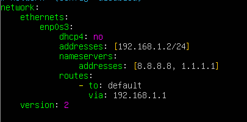

## 1. Introducción

**Samba** es un software de código abierto muy utilizado en sistemas operativos basados en Unix y Linux para proporcionar servicios de intercambio de archivos e impresoras con sistemas Windows. Su desarrollo comenzó en la década de 1990, y desde entonces, ha sido una herramienta esencial en **entornos de red heterogéneos**, donde conviven sistemas operativos diferentes.

Un **entorno o escenario de red** heterogéneo se refiere a una infraestructura de red informática en la cual coexisten y se comunican múltiples sistemas.


##  2. Conceptos básicos

### Samba 

Samba es una implementación libre de código abierto del protocolo de ficheros compartidos SMB/CIFS para sistemas de tipo UNIX. Samba permite la interoperabilidad entre servidores Linux/Unix y clientes basados en Windows. Samba le ofrece al administrador de red libertad y flexibilidad en términos de ajustes, configuración y elección de sistemas y equipos. 

Samba proporciona servicios de archivos e impresión y puede integrarse en un dominio Windows, ya sea como controlador de dominio principal (PDC) o como miembro del dominio. 

### SMB/CIFS 

**Server Message Block (SMB) y Common Internet File System (CIFS)** son protocolos de red desarrollados para compartir archivos e impresoras entre nodos de una red. El protocolo SMB fue desarrollado originalmente por IBM y posteriormente ampliado por Microsoft y renombrado como CIFS. 

Los términos SMB y CIFS son a menudo intercambiables pero hay características en la implementación de SMB de Microsoft que no son parte del protocolo SMB original. Sin embargo, desde una perspectiva funcional, ambos son protocolos utilizados por Samba. 


### Kerberos 

**Kerberos** es un protocolo de seguridad creado por el MIT que usa una criptografía de claves simétricas para validar usuarios con los servicios de red, evitando así tener que enviar contraseñas a través de la red. Al validar los usuarios para los servicios de la red por medio de Kerberos, se frustran los intentos de usuarios no autorizados que intentan interceptar contraseñas en la red. 

Kerberos funciona a base de "tickets" que se otorgan por una tercera parte de confianza llamado centro de distribución de claves (KDC) para autenticar los usuarios a un conjunto de servicios de red. Una vez que el usuario se ha autenticado al KDC, se le envía un ticket específico para esa sesión de vuelta a la máquina del usuario. De esta manera cualquier servicio kerberizado buscará el ticket en la máquina del usuario en vez de preguntarle al usuario que se autentique usando una contraseña. 

**Kerberos** tiene su propia terminología para definir varios aspectos del servicio: 

- **Realm/Reino**: red que usa Kerberos, compuesto de uno o varios servidores (también conocidos como KDCs) y un número potencial de clientes. 

- **Principal**: es el nombre único de un usuario o servicio que puede autenticar mediante el uso de Kerberos. Todos los principales de un reino tienen su propia llave, que en el caso de los usuarios se deriva de su contraseña y en le de los servicios se genera aleatoriamente. 

- **Ticket**: son datos cifrados que el servidor Kerberos facilita a los clientes para su autenticación y que estos almacenan durante la sesión. Los principales tipos de tickets son: 
  - Ticket Granting Ticket (TGT): ticket de autenticación de un usuario en la red y que se solicita al iniciar la sesión. Normalmente los TGT tienen una validez de 10 horas. 
  - Ticket Granting Service (TGS): ticket que solicita un usuario para autenticarse frente a un servidor que también esté en la base de datos de Kerberos. 

- **KDC** (Centro de Distribución de de Claves): servidor Kerberos encargado de la autenticación, compuesto por un AS (Servidor de Autenticación) encargado de repartir los TGT y un Ticket Granting Server encargado de distribuir los TGS. 

### LDAP

**LDAP** son las siglas de **Lightweight Directory Access Protocol (en español Protocolo Ligero de Acceso a Directorios)** que hacen referencia a un 

protocolo a nivel de aplicación que permite el acceso a un servicio de directorio ordenado y distribuido para buscar diversa información en un 

entorno de red. LDAP también se considera una base de datos (aunque su sistema de almacenamiento puede ser diferente) a la que pueden 

realizarse consultas. 

LDAP organiza la información en una jerarquía basada en el uso de directorios. Estos directorios pueden almacenar una variedad de 

información y se pueden incluso usar de forma similar al Servicio de Información de Red (NIS), permitiendo que cualquiera pueda acceder a su 

cuenta desde cualquier máquina de la red. 

### Domain Name System (DNS) 

**Sistema de Nombres de Dominio (DNS)** es un sistema de nomenclatura jerárquica para equipos, servicios o cualquier recurso conectado a Internet o a una red privada. Este sistema asocia información variada con nombres de dominios asignados a cada uno de los participantes. Su función más importante, es traducir (resolver) nombres inteligibles para las personas en identificadores binarios asociados con los equipos conectados a la red, con el propósito de poder localizar y direccionar estos equipos mundialmente. 

El servidor DNS utiliza una base de datos distribuida y jerárquica que almacena información asociada a nombres de dominio en redes como Internet. Aunque como base de datos el DNS es capaz de asociar diferentes tipos de información a cada nombre, los usos más comunes son la asignación de nombres de dominio a direcciones IP y la localización de los servidores de correo electrónico de cada dominio. En Ubuntu Server la configuración del DNS se puede ver en fichero **/etc/resolv.conf**. 

### Network Time Protocol (NTP) 

Network Time Protocol (NTP) es un protocolo de Internet que se utiliza para sincronizar los relojes del sistema del ordenador a una fuente de tiempo de referencia. En Debian, el demonio ntpd maneja la sincronización. Los parámetros de NTP se configuran en el archivo **/etc/ntp.conf**. 

!!! example "Tarea"
    **ACTIVIDAD GRUPAL Análisis y Presentación de Protocolos en Samba como Controlador de Dominio**

    **Objetivo General:**

    Analizar y presentar el funcionamiento de los protocolos fundamentales para Samba en su rol de controlador de dominio (DC), explorando su configuración y su importancia en la administración y seguridad de redes.

     **Descripción de la Actividad:**

    En esta práctica, cada grupo estudiará los protocolos **Kerberos**, **NTP**, **LDAP** y **DNS** en el contexto de Samba como controlador de dominio. Su objetivo es entender en profundidad el papel de cada protocolo, cómo se configuran en un entorno Linux con Samba y de qué manera estos protocolos colaboran para garantizar un entorno de dominio seguro y eficiente.

---

## PRÁCTICA 1

##  Implementación de un servidor Samba como Controlador de Dominio (AD DC) en Ubuntu Server 22.04 LTS y unión de un cliente Windows 10 al dominio


## Objetivos:

- Implementar un servidor Ubuntu Server 22.04 LTS como controlador de dominio Samba (AD DC).
- Integrar un equipo con Windows 10 en el dominio gestionado por Samba.
- Gestionar usuarios y grupos dentro del dominio Samba desde el servidor.

## 1. Preparación del servidor Ubuntu Server

Una vez que tengamos una máquina con ubuntu Server 22.04 instalado realizamos los siguientes pasos: 


#### 1. Cambiar el nombre del servidor

```bash
sudo hostnamectl set-hostname dcNombreApellidos
```

**Explicación:**

- Se cambia el nombre del host al formato `dcNombreApellidos`, que identifica de forma única al servidor del alumno.
- Sustituir `NombreApellidos` por el nombre real del alumno sin espacios.

#### 2. Configurar IP estática en el servidor

Abrimos el archivo de configuración de la red  00-installer-config.yaml o 50-cloud-init.yaml depende la instalación que hayas realizado.

```bash
sudo nano /etc/netplan/00-installer-config.yaml
```



Para aplicar los cambios ejecuta el siguiente comando

```bash
sudo netplan apply
```


#### 3. Modificar el archivo `/etc/hosts`

```
sudo nano /etc/hosts
Añadir la línea correspondiente, por ejemplo:
192.168.1.2 dcJuanPerez.ieselcaminas.local dcJuanPerez
```

**Explicación:**

- Esta línea asocia el FQDN del servidor y su alias corto con la IP fija `192.168.1.2`.
- Cada alumno deberá personalizarla con su propio nombre de host.

#### 4. Verificar el FQDN

```
hostname -f
Debe mostrar:
dcNombreApellidos.ieselcaminas.local
```


#### 5. Verificar si el FQDN resuelve la dirección IP

```bash
ping -c2 dcNombreApellidos.ieselcaminas.local
```


**Explicación:**

- El comando `ping` permite comprobar si un nombre de dominio se resuelve correctamente y si el host está accesible.
- El parámetro `-c2` indica que se envíen solo 2 paquetes.
- Si la respuesta incluye líneas como:
   `"Respuesta desde dcNombreApellidos.ieselcaminas.local"`,
   significa que el FQDN se ha resuelto correctamente a la IP asignada.

#### 6. Desactivar el servicio systemd-resolved

```bash
sudo systemctl disable --now systemd-resolved
```

**Explicación:**

- El servicio `systemd-resolved` gestiona la resolución de nombres de dominio en sistemas modernos basados en systemd.
- Es necesario desactivarlo porque **Samba AD DC** debe encargarse directamente de la resolución de nombres, sin interferencias externas, para que funcione correctamente como servidor DNS del dominio.


#### 7. Eliminar el enlace simbólico al archivo /etc/resolv.conf

```bash
sudo unlink /etc/resolv.conf
```


**Explicación:**

- El archivo `/etc/resolv.conf` contiene la configuración del sistema para la resolución de nombres de dominio.
- En Ubuntu, este archivo suele ser un **enlace simbólico** gestionado por `systemd-resolved`.
   Para que Samba tenga control completo del DNS, eliminamos ese enlace y gestionamos el archivo de forma manual.

#### 8. Crear el archivo /etc/resolv.conf con el contenido definitivo

```bash
sudo nano /etc/resolv.conf
```

```
nameserver 127.0.0.1
nameserver 8.8.8.8
search ieselcaminas.local
```

**Explicación:**

- `nameserver 127.0.0.1` hace que el servidor se consulte a sí mismo para la resolución de nombres. Samba AD DC incluye su propio servidor DNS interno que escucha en loopback.
- `nameserver 8.8.8.8` actúa como DNS externo de respaldo para resolver dominios fuera de `ieselcaminas.local`.
- `search ieselcaminas.local` permite usar nombres cortos sin el sufijo del dominio en las consultas DNS.

#### 9. Hacer inmutable el archivo /etc/resolv.conf

```bash
sudo chattr +i /etc/resolv.conf
```

**Explicación:**

- El comando `chattr +i` establece el atributo **inmutable** sobre el archivo.
- Esto impide que otros servicios (como resolvconf o systemd) lo sobrescriban o modifiquen accidentalmente.
- Si más adelante necesitas editar el archivo, puedes hacerlo con:

```bash
sudo chattr -i /etc/resolv.conf
```


##  2. Instalación de Samba

#### 1. Actualiza el índice de paquetes disponibles en los repositorios configurados

```bash
sudo apt update
```


#### 2. Instalar el paquete samba y las dependencias necesarias

```bash
sudo apt install -y acl attr samba samba-dsdb-modules samba-vfs-modules smbclient winbind libpam-winbind libnss-winbind libpam-krb5 krb5-config krb5-user dnsutils chrony net-tools
```


| **Paquete**          | **Función**                                                  | **¿Es imprescindible para un AD DC?** |
| -------------------- | ------------------------------------------------------------ | ------------------------------------- |
| `acl`                | Permite configurar listas de control de acceso (ACL) en archivos y carpetas. | Recomendado                           |
| `attr`               | Añade soporte para atributos extendidos en archivos, útil en entornos avanzados. | Recomendado                           |
| `samba`              | Instala el servicio principal Samba, que permite que el servidor funcione como un Controlador de Dominio (AD DC). | **Sí, imprescindible**                |
| `samba-dsdb-modules` | Añade módulos internos necesarios para la base de datos del dominio Samba. | **Sí, imprescindible**                |
| `samba-vfs-modules`  | Extiende las capacidades de Samba para usar funciones como auditorías o cuotas de disco. | Recomendado                           |
| `smbclient`          | Cliente de línea de comandos para conectarse a recursos compartidos SMB. Útil para pruebas. | Opcional pero útil                    |
| `winbind`            | Permite al servidor resolver usuarios y grupos del dominio. También se usa para integrar equipos Linux como clientes del dominio. | Recomendado                           |
| `libpam-winbind`     | Permite iniciar sesión en el sistema Linux con usuarios del dominio, usando PAM. | Opcional                              |
| `libnss-winbind`     | Hace que los usuarios y grupos del dominio aparezcan como usuarios locales para el sistema. | Opcional                              |
| `libpam-krb5`        | Añade autenticación Kerberos al sistema mediante PAM.        | Opcional                              |
| `krb5-config`        | Archivos de configuración para el sistema de autenticación Kerberos. | **Sí, imprescindible**                |
| `krb5-user`          | Herramienta para autenticarse como usuario mediante Kerberos desde consola. | Recomendado                           |
| `dnsutils`           | Incluye herramientas como `dig` para probar y depurar el DNS del dominio. | Recomendado                           |
| `chrony`             | Sincroniza la hora del sistema, lo cual es esencial para que funcione Kerberos correctamente. | **Sí, imprescindible** (o `ntp`)      |
| `net-tools`          | Herramientas clásicas como `ifconfig` o `netstat`, útiles para diagnóstico de red. | Opcional                              |

#### 3. Detener y deshabilitar servicios innecesarios

Para evitar conflictos con el controlador de dominio Samba, detenemos y deshabilitamos algunos servicios que no deben estar activos en este modo:

```bash
sudo systemctl disable --now smbd nmbd winbind
```

-  **smbd** y **nmbd** son servicios clásicos de Samba que no se utilizan cuando el servidor actúa como **Controlador de Dominio (AD DC)**.
- En un **Controlador de Dominio Samba**, `winbind` no debe estar activo. Solo se instala y se usa en los **clientes Linux del dominio**.

#### 4. Habilitación del servicio Samba como Controlador de Dominio (AD DC)

Para que el servicio Samba funcione como **Controlador de Dominio Active Directory**, es necesario **desbloquearlo** y **habilitar su arranque automático**:

```bash
sudo systemctl unmask samba-ad-dc
sudo systemctl enable samba-ad-dc
```

- **sudo systemctl unmask samba-ad-dc**: Elimina la "máscara" del servicio, permitiendo que pueda activarse y gestionarse. Algunos servicios vienen bloqueados por defecto.
- **sudo systemctl enable samba-ad-dc**:
  Activa el inicio automático del servicio al arrancar el sistema, dejándolo listo para funcionar como AD DC.

#### 5. Aprovisionar el dominio

Este es el paso central de la instalación. El comando `samba-tool domain provision` crea la estructura del dominio Active Directory.

```bash
sudo samba-tool domain provision \
  --use-rfc2307 \
  --realm=IESELCAMINAS.LOCAL \
  --domain=IESELCAMINAS \
  --server-role=dc \
  --dns-backend=SAMBA_INTERNAL \
  --adminpass='Admin1234!'
```

**Explicación de los parámetros:**

| Parámetro | Descripción |
| --------- | ----------- |
| `--use-rfc2307` | Habilita atributos POSIX (UID, GID, shell...) en el directorio, necesarios para integrar clientes Linux |
| `--realm` | Nombre del realm Kerberos en **mayúsculas**. Debe coincidir con el dominio DNS |
| `--domain` | Nombre NetBIOS del dominio (parte corta, en mayúsculas) |
| `--server-role=dc` | Configura el servidor como Controlador de Dominio |
| `--dns-backend=SAMBA_INTERNAL` | Usa el servidor DNS interno de Samba |
| `--adminpass` | Contraseña del administrador del dominio. Debe cumplir los requisitos de complejidad |

!!! warning "Atención"
    La contraseña del administrador debe tener al menos 8 caracteres e incluir mayúsculas, minúsculas y números o símbolos. Si no cumple los requisitos, el aprovisionamiento fallará.

Si el aprovisionamiento termina correctamente, verás una salida similar a:

```
Setting up share.ldb
Setting up secrets.ldb
Setting up the registry
Setting up the privileges database
Setting up idmap db
Setting up SAM db
Setting up sam.ldb partitions and settings
...
Server Role:           active directory domain controller
Hostname:              dcNombreApellidos
NetBIOS Domain:        IESELCAMINAS
DNS Domain:            ieselcaminas.local
DOMAIN SID:            S-1-5-21-XXXXXXXXXX-XXXXXXXXXX-XXXXXXXXXX
```

#### 6. Configurar Kerberos

El aprovisionamiento genera automáticamente el fichero de configuración de Kerberos. Solo es necesario copiarlo a la ubicación que espera el sistema:

```bash
sudo cp /var/lib/samba/private/krb5.conf /etc/krb5.conf
```

Verificar que el contenido es correcto:

```bash
cat /etc/krb5.conf
```

Debe mostrar algo similar a:

```ini
[libdefaults]
    default_realm = IESELCAMINAS.LOCAL
    dns_lookup_realm = false
    dns_lookup_kdc = true
```

#### 7. Iniciar el servicio Samba AD DC

```bash
sudo systemctl start samba-ad-dc
sudo systemctl status samba-ad-dc
```

La salida del estado debe mostrar **active (running)**:

```
● samba-ad-dc.service - Samba AD Daemon
     Loaded: loaded (/lib/systemd/system/samba-ad-dc.service; enabled)
     Active: active (running) since ...
```

---

## 3. Verificación del Dominio

Antes de unir clientes al dominio, hay que verificar que los servicios DNS, Kerberos y LDAP funcionan correctamente.

#### 1. Verificar la información del dominio

```bash
sudo samba-tool domain info 127.0.0.1
```

Salida esperada:

```
Forest           : ieselcaminas.local
Domain           : ieselcaminas.local
Netbios domain   : IESELCAMINAS
DC name          : dcnombreapellidos.ieselcaminas.local
DC netbios name  : DCNOMBREAPELLIDOS
Server site      : Default-First-Site-Name
Client site      : Default-First-Site-Name
```

#### 2. Verificar el DNS

El DNS es crítico para que los clientes puedan localizar el controlador de dominio. Comprobar que los registros SRV de Kerberos y LDAP se resuelven correctamente:

```bash
host -t SRV _kerberos._udp.ieselcaminas.local 127.0.0.1
host -t SRV _ldap._tcp.ieselcaminas.local 127.0.0.1
host -t A dcNombreApellidos.ieselcaminas.local 127.0.0.1
```

Salida esperada:

```
_kerberos._udp.ieselcaminas.local has SRV record 0 100 88 dcnombreapellidos.ieselcaminas.local.
_ldap._tcp.ieselcaminas.local has SRV record 0 100 389 dcnombreapellidos.ieselcaminas.local.
dcnombreapellidos.ieselcaminas.local has address 192.168.1.2
```

!!! warning "Atención"
    Si los registros SRV no se resuelven, los clientes no podrán unirse al dominio. Verifica que el servicio `samba-ad-dc` está activo y que `resolv.conf` apunta a `127.0.0.1`.

#### 3. Verificar Kerberos

```bash
kinit administrator@IESELCAMINAS.LOCAL
```

Introduce la contraseña del administrador cuando se solicite. A continuación, verifica que se ha obtenido el ticket:

```bash
klist
```

Salida esperada:

```
Credentials cache: FILE:/tmp/krb5cc_0
        Principal: administrator@IESELCAMINAS.LOCAL

  Issued                Expires               Principal
ene 01 10:00:00 2025  ene 01 20:00:00 2025  krbtgt/IESELCAMINAS.LOCAL@IESELCAMINAS.LOCAL
```

#### 4. Verificar el acceso LDAP y SMB

```bash
# Listar recursos compartidos del dominio
smbclient -L localhost -U administrator

# Listar usuarios del dominio
sudo samba-tool user list
```

La salida de `samba-tool user list` debe mostrar al menos el usuario `Administrator` y `Guest`.

---

## 4. Unión del cliente Windows al dominio

#### 1. Configurar la red del cliente Windows

En el cliente Windows 10/11, configurar la red con los siguientes valores (adaptando la IP al rango de tu red):

| Parámetro | Valor |
| --------- | ----- |
| Dirección IP | 192.168.1.50 |
| Máscara de subred | 255.255.255.0 |
| Puerta de enlace | 192.168.1.1 |
| **DNS preferido** | **192.168.1.2** (IP del servidor Samba) |

!!! warning "Atención"
    El DNS del cliente **debe apuntar al servidor Samba**. Si apunta a otro servidor DNS, el cliente no encontrará los registros SRV del dominio y la unión fallará.

#### 2. Verificar la conectividad con el servidor

Desde la consola CMD del cliente Windows:

```cmd
ping 192.168.1.2
ping ieselcaminas.local
```

Ambos pings deben responder correctamente antes de intentar unir el equipo al dominio.

#### 3. Unir el equipo al dominio

1. Abrir **Configuración → Sistema → Acerca de → Configuración avanzada del sistema**.
2. En la pestaña **Nombre de equipo**, hacer clic en **Cambiar**.
3. Seleccionar **Dominio** e introducir `ieselcaminas.local`.
4. Introducir las credenciales del administrador del dominio:
   - Usuario: `administrator`
   - Contraseña: `Admin1234!`
5. Si todo es correcto, aparecerá el mensaje **"Bienvenido al dominio ieselcaminas.local"**.
6. Reiniciar el equipo.

#### 4. Verificar la unión desde el servidor

Desde el servidor, comprobar que el equipo aparece en el directorio:

```bash
sudo samba-tool computer list
```

---

## 5. Gestión de usuarios y grupos desde el servidor

### 5.1 Gestión de usuarios con samba-tool

#### Crear un usuario

```bash
sudo samba-tool user create alumno1 'Passw0rd!' \
  --given-name="Alumno" \
  --surname="Uno" \
  --mail-address="alumno1@ieselcaminas.local"
```

#### Listar usuarios del dominio

```bash
sudo samba-tool user list
```

#### Consultar información de un usuario

```bash
sudo samba-tool user show alumno1
```

#### Deshabilitar y habilitar una cuenta

```bash
# Deshabilitar
sudo samba-tool user disable alumno1

# Habilitar
sudo samba-tool user enable alumno1
```

#### Cambiar la contraseña de un usuario

```bash
sudo samba-tool user setpassword alumno1 --newpassword='NuevoPass1!'
```

#### Eliminar un usuario

```bash
sudo samba-tool user delete alumno1
```

### 5.2 Gestión de grupos con samba-tool

#### Crear un grupo

```bash
sudo samba-tool group add alumnos
sudo samba-tool group add profesores
```

#### Listar grupos del dominio

```bash
sudo samba-tool group list
```

#### Añadir un usuario a un grupo

```bash
sudo samba-tool group addmembers alumnos alumno1
sudo samba-tool group addmembers alumnos alumno2,alumno3
```

#### Ver los miembros de un grupo

```bash
sudo samba-tool group listmembers alumnos
```

#### Eliminar un usuario de un grupo

```bash
sudo samba-tool group removemembers alumnos alumno1
```

#### Eliminar un grupo

```bash
sudo samba-tool group delete alumnos
```

### 5.3 Tabla resumen de comandos samba-tool

| Acción | Comando |
| ------ | ------- |
| Crear usuario | `samba-tool user create <nombre> <contraseña>` |
| Listar usuarios | `samba-tool user list` |
| Deshabilitar usuario | `samba-tool user disable <nombre>` |
| Cambiar contraseña | `samba-tool user setpassword <nombre> --newpassword=<pass>` |
| Eliminar usuario | `samba-tool user delete <nombre>` |
| Crear grupo | `samba-tool group add <nombre>` |
| Listar grupos | `samba-tool group list` |
| Añadir miembro a grupo | `samba-tool group addmembers <grupo> <usuario>` |
| Ver miembros de un grupo | `samba-tool group listmembers <grupo>` |
| Eliminar grupo | `samba-tool group delete <nombre>` |
| Info del dominio | `samba-tool domain info 127.0.0.1` |
| Listar equipos | `samba-tool computer list` |

---

## 6. Actividades

!!! example "Tarea"

    **Actividad 1. Instalación y verificación**

    Sigue todos los pasos de la práctica para instalar y configurar Samba AD DC en Ubuntu Server 22.04.
    Una vez completada la instalación, verifica que:

    - El comando `samba-tool domain info 127.0.0.1` muestra la información correcta del dominio.
    - Los registros DNS SRV de Kerberos y LDAP se resuelven correctamente.
    - `kinit administrator@IESELCAMINAS.LOCAL` obtiene un ticket Kerberos válido.

!!! example "Tarea"

    **Actividad 2. Gestión de usuarios y grupos**

    Desde el servidor Samba, crea la siguiente estructura de usuarios y grupos:

    - Grupo `profesores` con los usuarios: `prof1`, `prof2`.
    - Grupo `alumnos` con los usuarios: `alu1`, `alu2`, `alu3`.

    Verifica con `samba-tool group listmembers` que los usuarios están correctamente asignados.

!!! example "Tarea"

    **Actividad 3. Unión al dominio**

    Une un cliente Windows 10/11 al dominio `ieselcaminas.local`.

    - Configura el DNS del cliente apuntando al servidor Samba.
    - Verifica la conectividad antes de unir (`ping ieselcaminas.local`).
    - Una vez unido, inicia sesión en el cliente con el usuario `prof1` creado en la actividad anterior.
    - Desde el servidor, verifica que el equipo Windows aparece en `samba-tool computer list`.
